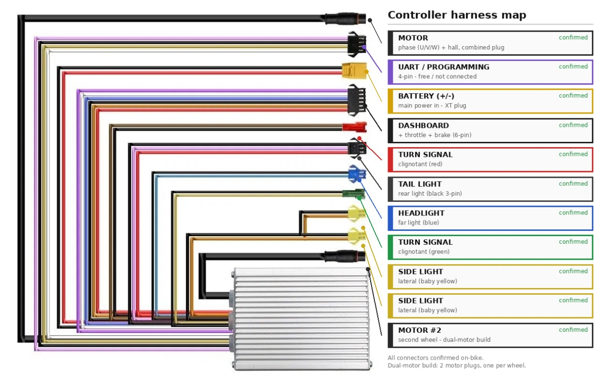
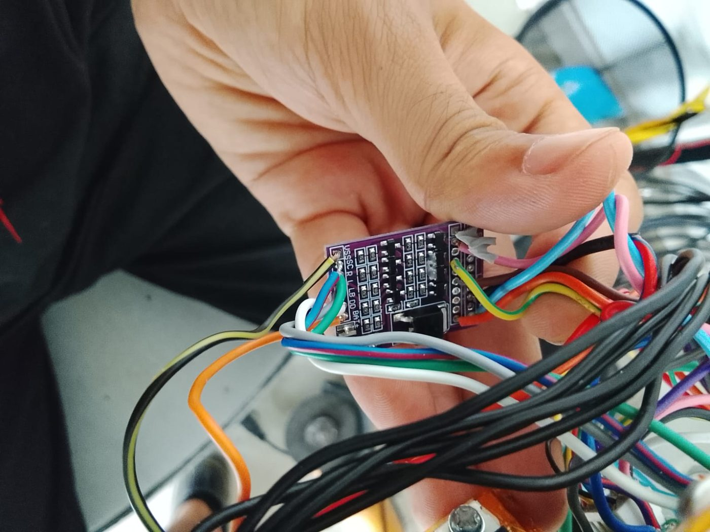
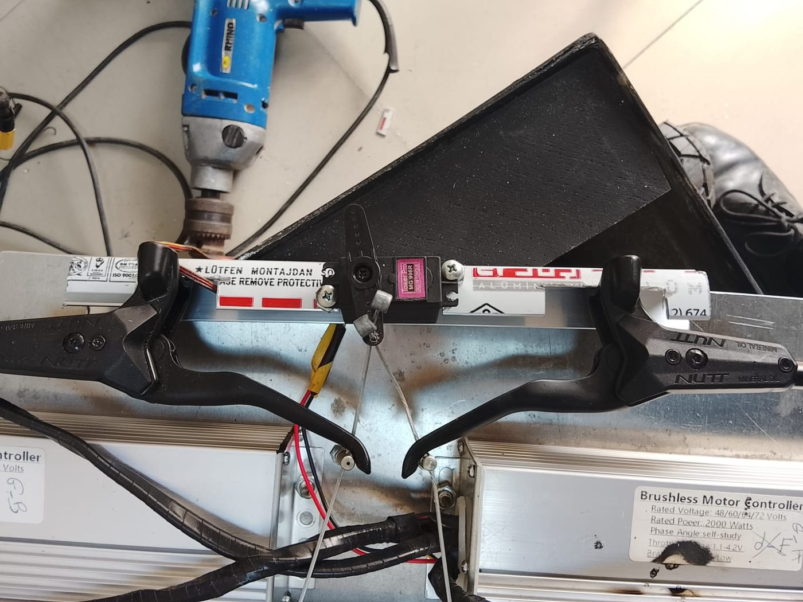

# Electric-Scooter Drive — Reverse Engineering
> Taking control of a sealed motor controller by first finding out what its display bus actually carried — the origin of SHADOW's drivetrain.
`2025` · `Arduino` · `Bus sniffing` · `Protocol decoding` · `PWM + RC` · `PI control` · `Reverse engineering`



## About

Before SHADOW there was a scooter: a sealed commercial motor controller with no documented command interface, and the open question of whether a microcontroller could drive it at all.

**Sniffing the bus.** I wired an Arduino onto the line between the controller and the handlebar display and captured the traffic. The frame is a fixed-length packet ending in an XOR checksum — readable once the checksum was worked out — carrying speed, battery state and faults.

**The finding that redirected the project was a negative one:** that bus is *telemetry, not command*. Nothing sent on it makes a wheel turn. Establishing that saved all the effort that would have gone into forging command frames which do not exist, and moved the search to the dashboard connector instead.

**The real control path is the analog throttle line.** Mapping the six-pin dashboard connector located it, and driving it with PWM through a 1 kΩ + 10 µF RC network turns a digital output into the smooth analog voltage the controller expects. With wheel speed decoded from the display bus as feedback, a PI loop closes the speed control — the telemetry bus turned out to be useful for exactly the half of the problem it was suited to.

This is not archived history. SHADOW's four motor channels are driven exactly this way today; the 4WD documentation asserts that RC filter as a given, and this project is where it comes from.

## Figures





## Contents

```
AGENTS.md
CAHIER_DES_CHARGES.html
CAHIER_DES_CHARGES_SHADOW.pdf
README.md
docs/
firmware/
firmware_stm32/
flash.sh
flash_stm32.sh
setup.sh
tools/
wires.jpeg
```

## Notes

## Third-party work used here

Everything in this repository is my own work. It builds on the following, which are **not** mine and are used under their own licences:

- **Arduino core** by Arduino — <https://github.com/arduino/ArduinoCore-avr>

## Author

Lassaad Mahmoudi — <assaadmahmoudi0@gmail.com>  
https://linkedin.com/in/mahmoudiassaad
